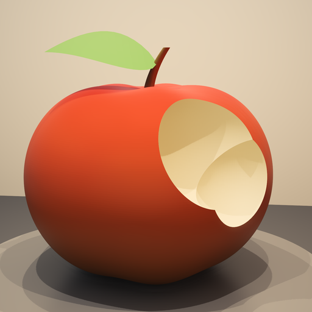

# MetalHardwareRayTracing

**by Brememememe (Ruchit) YouTube: https://www.youtube.com/@RuchitBreme**

Real hardware ray tracing for Minecraft Java, written in Metal for Apple
Silicon. Not a shaderpack: Minecraft's world rasteriser is switched off and the
world is traced instead, by the GPU's own ray tracing units, and handed back to
Minecraft as a finished frame before it draws everything else on top.

## Download

Get the jar from **[Releases](https://github.com/Brememememe/MetalHardwareRayTracing/releases)**
and drop it in your instance's `mods/` folder with Fabric API. That is the whole
install - the Metal core and the shader ride inside the jar and unpack
themselves on first run.

    mhrt-1.41.0.jar        Minecraft 26.2
    mhrt-1.41.0+26.3.jar   Minecraft 26.3

## New in 1.41.0

**Every cow gets its own model.** A renderer that keeps more than one model -
every adult-and-baby pair, and every variant renderer: cow, pig, chicken, the
fishes - picks between them *inside* its submit, by assigning its own `model`
field. MHRT asked for the model before that had happened, so it got back
whichever one was used last, for some other animal entirely. The texture was
always right, because that comes from the render state, so a warm cow was drawn
with the temperate cow's cubes and its own skin stretched over them - which puts
the texture on the wrong parts and reads as missing. Whichever cow the game drew
last decided which cows looked wrong, which is why it was only ever *some* of
them. Proved by logging which model object each cow was handed: one shared
object before, four distinct ones after.

Also new: the settings are reached from **Options > Video Settings**, scroll to
the bottom.

## What you need

* **macOS on Apple Silicon.** Nothing else - there is no Windows or Linux build
  and there cannot be; it is Metal all the way down.
* **A GPU that reports Metal ray tracing.** M3 and later have it in hardware.
  Built and measured on an M4 Pro; on earlier chips it will run far slower if it
  runs at all, and it tells you in the log rather than crashing.
* **Fabric Loader 0.16+ and Fabric API.**
* **Minecraft 26.2 or 26.3** - one jar each, and they are not interchangeable.
  The wrong one refuses to load rather than breaking your game.

## What it draws

* **Sunlight and sky light** traced, with real shadows that come from the
  geometry itself - soft edges, contact shadows, no shadow map, no cascades and
  none of the peter-panning that goes with them.
* **Bounced indirect light.** Colour carries: a red wool floor puts red into the
  ceiling above it. Traced at a quarter of the pixels and upsampled.
* **Reflections** in water, glass, ice and polished metals, of the real world
  rather than a screen-space copy of it - things off the edge of the screen and
  behind you are in the reflection because they are actually traced.
* **Water with a depth to it**, refraction through glass, stained glass that
  tints the light passing through it, and Snell's window from underneath.
* **Every block light at once.** Torches, lava, glowstone, froglights, a
  furnace's fire - each with its own colour and falloff, sampled rather than
  baked into a lightmap.
* **Beacon beams** integrated along the ray, so the beam actually lights what
  it passes.
* **Entities as traced geometry.** The 26.3 build traces every entity its
  renderer will describe: the player, mobs, dropped items, boats and chest
  boats, minecarts and the blocks they carry, paintings, item frames, armour
  stands, falling blocks, primed TNT, end crystals, arrows, experience orbs and
  item displays - and what a mob is HOLDING, so a skeleton has its bow and a
  zombie its sword. The 26.2 build traces the player, mobs and dropped items.
* **Moving things keep their history.** Every box carries the transform it had
  a frame ago, so the denoiser follows a surface through the world instead of
  only following the camera. A spinning end crystal, a walking mob, a swinging
  chest lid and a dropped item are converged the way the ground they stand on
  is, rather than being shown at close to a single traced sample. Measured on a
  crystal filling the frame, it moves 2.1 times as much between frames as it
  did - which is the damping coming off.
* **Grass, leaves and flowers that do not turn into an LOD.** A cut-out texture
  is read at full resolution however far away it is, so distant grass is the
  same blade, the same colour and the same thinness as the grass at your feet
  rather than a dark, fat smudge - and a plant's shadow is the shape of the
  plant, not of the rectangle its texture is painted on.
* **Pack textures at their own resolution**, connected textures, animated
  blocks, block entities - chests that open, signs you can read, banners.
* **The Nether and the End** with their own skies, and the End's flash.

The picture is denoised with a temporal pass and a wavelet filter, then
temporally upsampled to your display's resolution, and the render scale moves
itself to hold a steady frame time.

## What is still Minecraft's

Minecraft's own pass runs over the traced frame, so everything it draws is still
there and correctly hidden behind traced walls: particles, rain and snow, the
world border, name tags, leads, the GUI and your hand. Text displays, block
displays and lightning are drawn by Minecraft too.

## Performance

On an M4 Pro at 1080p, a normal overworld sits around 9 to 12 ms of tracing a
frame at 70-85% render scale, which leaves the frame rate at whatever your
display allows. Two knobs matter most:

* **Resolution**, in those panes. The traced picture is rendered below your
  display's resolution and upsampled; this is the frame-time dial.
* **Minecraft's render distance.** Ray tracing is bounded - 10 to 12 chunks
  matches what is traced. Setting Minecraft higher costs you frames for terrain
  the tracer is not using.

## Settings

**Options > Video Settings**, then scroll to the bottom: under a **Metal ray
tracing** header there is an **MHRT settings...** button. That opens the panes:
quality preset, resolution, bounces, denoising, shadows, the colour grade,
lights, and how many entities are traced a frame.

Files beside `options.txt` (they are optional; without them it uses its
defaults):

| file | what it does |
|---|---|
| `mhrt-settings`, `mhrt-grade`, `mhrt-lights` | your saved settings, written by the panes |
| `mhrt-noentities` | hand every entity back to Minecraft |
| `mhrt-nocushions` | cushions only |
| `mhrt-nomotion` | reproject by the camera alone, as it did before 1.40.0 |
| `Shaders.metal`, `libmhrt.dylib` | override what the jar carries (the jar ships the shader compiled) |

## Known limits

* **macOS and Apple Silicon only.** Always.
* **A self-shadowing model reads darker than Minecraft draws it.** An end
  crystal's lattice shadows its own core; Minecraft's flat lightmap never does,
  so it measures a few per cent darker here. That is the tracer being right
  rather than wrong, but it is a visible difference.
* **A model that changes shape loses its motion for a single frame** - a mob
  drawing its sword, armour going on - because the parts it is built from shift
  and there is no longer any telling which was which.
* **The traced range is bounded**, because acceleration structures cost memory:
  32 chunks in every direction is over 3 GB.
* **No shaderpack compatibility.** It replaces the same thing shaderpacks
  replace.
* **Not compatible with other renderer mods** that also draw the world
  (Sodium-likes, Flywheel/Vanillin instancing).

## Bugs

Please open an issue:
**https://github.com/Brememememe/MetalHardwareRayTracing/issues**

Include your Mac's chip, your Minecraft version, the MHRT version and the lines
from your log that begin with `[mhrt]`. If the mod hit something it could not
handle it turns itself off and says so in that log rather than leaving you a
black screen, and that line is usually the whole answer.

## Elsewhere

Videos of it, and whatever else I am building:
**https://www.youtube.com/@RuchitBreme**

## Licence

All rights reserved. You may download it and play with it; please do not
mirror, repackage or fork it without asking first.

## Source

This repository is the download page and the bug tracker. The source is not
public: the mod is all rights reserved, and that includes the Metal shader and
the Swift core. If you want to do something with it that needs the code, open an
issue and ask.
