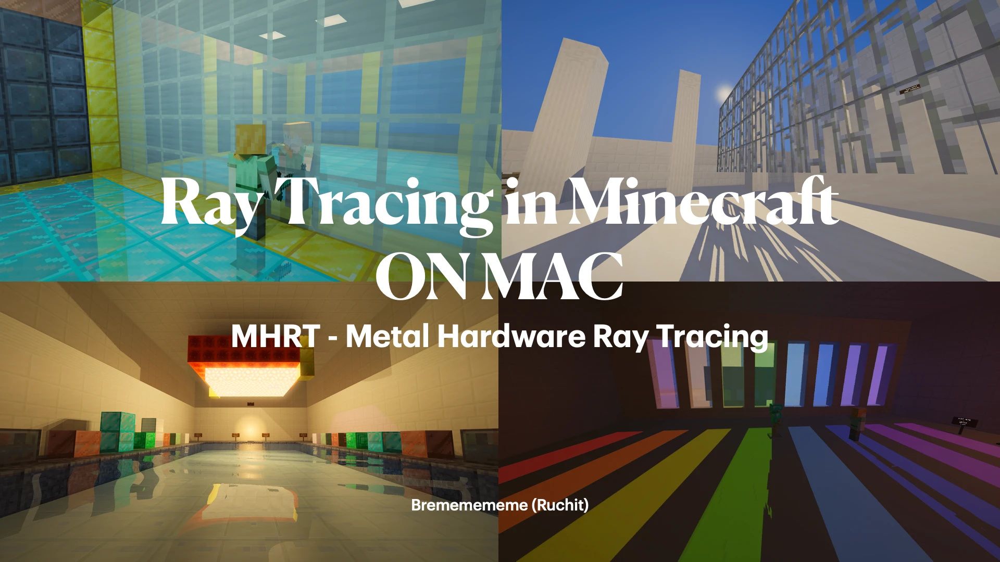
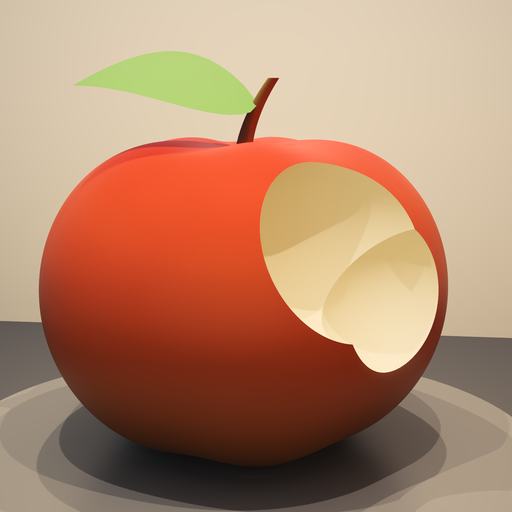

# MetalHardwareRayTracing

**by Brememememe (Ruchit) YouTube: https://www.youtube.com/@RuchitBreme**

**Watch it:** [the MHRT 1.44.0 showcase](https://www.youtube.com/watch?v=Gu3o0UQ6Z-4) - every
room of the test world, a village, the Nether and an End city, recorded in game on
an M4 Pro.

Real hardware ray tracing for Minecraft Java, written in Metal for Apple
Silicon. Not a shaderpack: Minecraft's world rasteriser is switched off and the
world is traced instead, by the GPU's own ray tracing units, and handed back to
Minecraft as a finished frame before it draws everything else on top.

## Download

Get the jar from **[Releases](https://github.com/Brememememe/MetalHardwareRayTracing/releases)**
and drop it in your instance's `mods/` folder with Fabric API. That is the whole
install - the Metal core and the shader ride inside the jar and unpack
themselves on first run.

    mhrt-1.45.0+26.2.jar   Minecraft 26.2
    mhrt-1.45.0+26.3.jar   Minecraft 26.3

    MHRT-Showcase-26.3.zip  the test world - Minecraft 26.3 only (see below)

## What you need

* **macOS on Apple Silicon.** Nothing else - there is no Windows or Linux build
  and there cannot be; it is Metal all the way down.
* **A GPU that reports Metal ray tracing.** M3 and later have it in hardware.
  Built and measured on an M4 Pro; on earlier chips it will run far slower if it
  runs at all, and it tells you in the log rather than crashing.
* **Fabric Loader 0.16+ and Fabric API.**
* **Minecraft 26.2 or 26.3** - one jar each, and they are not interchangeable.
  The wrong one refuses to load rather than breaking your game.

**26.2 support ends when the Sift comes out.** Mojang has announced the Sift,
Minecraft's first new dimension since the End, for Java Edition in 2027. When
the update that brings it is released, MHRT moves to it and the 26.2 build stops
getting updates. The last 26.2 jar stays on the Releases page.

## Test world

**[MHRT-Showcase-26.3.zip](MHRT-Showcase-26.3.zip)** is the world the showcase
video was recorded in, and the place to test MHRT. It is here in the repository,
and it is attached to every release as well.

**It is for Minecraft 26.3 only.** It is a 26.3 save: 26.2 cannot open it, so
test the 26.2 jar in a world of your own.

1. Unzip it into your 26.3 instance's `saves/` folder, so that you have
   `saves/MHRT Showcase/`.
2. Start Minecraft with MHRT and open **MHRT Showcase**. You start in the
   hall, in creative, with cheats on.
3. Walk the tour. Every room ends at a pressure plate with signs either side
   saying where it goes; step on it and it takes you to the next room and sets
   the hour that room was lit for.

Fifteen rooms, each built to show one thing and nothing else: sunlight and
shadow, soft shadow, colour bleeding off coloured walls, stained glass, water
(go under it for Snell's window), ice, reflections, twenty kinds of light at
once, a beacon, lava and fire, a room of mobs, things that move, chests and
frames and banners, and a garden for foliage and distance. After the garden the
plates go to a village, a hall in the Nether and a platform in the End, and the
last plate brings you back to the start.

Use it to test: a new version, a setting, a resource pack, or a bug. If
something looks wrong, find the room where it shows and say which one in the
issue - everyone can then see the same thing in the same place.

The zip keeps only the parts of the world the tour uses, so it is small; the
ground under the rooms and the land round the village are regenerated from the
world's seed the first time you go near them, and look the same.

## What it draws

* **Sunlight and sky light** traced, with real shadows that come from the
  geometry itself - soft edges, contact shadows, no shadow map, no cascades and
  none of the peter-panning that goes with them.
* **Bounced indirect light.** Colour carries: a red wool floor puts red into the
  ceiling above it. Traced at a quarter of the pixels and upsampled.
* **Reflections** in water, glass, ice and polished metals, of the real world
  rather than a screen-space copy of it - things off the edge of the screen and
  behind you are in the reflection because they are actually traced.
* **Water with a depth to it**, refraction through glass, stained glass that
  tints the light passing through it, and Snell's window from underneath.
* **Every block light at once.** Torches, lava, glowstone, froglights, a
  furnace's fire - each with its own colour and falloff, sampled rather than
  baked into a lightmap.
* **Beacon beams** integrated along the ray, so the beam actually lights what
  it passes.
* **Entities as traced geometry.** The 26.3 build traces every entity its
  renderer will describe: the player, mobs, dropped items, boats and chest
  boats, minecarts and the blocks they carry, paintings, item frames, armour
  stands, falling blocks, primed TNT, end crystals, arrows, experience orbs and
  item displays - and what a mob is HOLDING, so a skeleton has its bow and a
  zombie its sword. The 26.2 build traces the player, mobs and dropped items.
* **Moving things keep their history.** Every box carries the transform it had
  a frame ago, so the denoiser follows a surface through the world instead of
  only following the camera. A spinning end crystal, a walking mob, a swinging
  chest lid and a dropped item are converged the way the ground they stand on
  is, rather than being shown at close to a single traced sample. Measured on a
  crystal filling the frame, it moves 2.1 times as much between frames as it
  did - which is the damping coming off.
* **Grass, leaves and flowers that do not turn into an LOD.** A cut-out texture
  is read at full resolution however far away it is, so distant grass is the
  same blade, the same colour and the same thinness as the grass at your feet
  rather than a dark, fat smudge - and a plant's shadow is the shape of the
  plant, not of the rectangle its texture is painted on.
* **Pack textures at their own resolution**, connected textures, animated
  blocks, block entities - chests that open, signs you can read, banners.
* **The Nether and the End** with their own skies, and the End's flash.

The picture is denoised with a temporal pass and a wavelet filter, then
temporally upsampled to your display's resolution - by MHRT's own upscaler or
by Apple's MetalFX - and the render scale moves itself to hold a steady frame
time.

## What is still Minecraft's

Minecraft's own pass runs over the traced frame, so everything it draws is still
there and correctly hidden behind traced walls: particles, rain and snow, the
world border, name tags, leads, the GUI and your hand. Text displays, block
displays and lightning are drawn by Minecraft too.

## Performance

On an M4 Pro at 1080p, a normal overworld sits around 9 to 12 ms of tracing a
frame at 70-85% render scale, which leaves the frame rate at whatever your
display allows. Two knobs matter most:

* **Resolution**, in those panes. The traced picture is rendered below your
  display's resolution and upsampled; this is the frame-time dial.
* **Minecraft's render distance.** Ray tracing is bounded - 10 to 12 chunks
  matches what is traced. Setting Minecraft higher costs you frames for terrain
  the tracer is not using.

**Frame generation.** Off, 2x, 3x or 4x. Between two ray-traced frames it shows
the last traced frame again, moved to where the camera is now - so turning and
walking are as smooth as your display, while the world itself (mobs, water,
fire) changes at the traced rate. 2x shows up to one extra frame for each traced
one, 4x up to three. It adds no delay: the extra frames follow the mouse, and
the traced frames are moved to the newest camera too. On an M4 Pro at 1080p,
panning a room went from about 62 frames a second to about 90 at 2x, with each
extra frame costing about a millisecond of GPU time. It works best with VSync
on, and it needs *Pipelined frames* (it turns them on).

**Upscaling.** Only part of your display's resolution is ray traced; an
upscaler builds the full picture from it and the frames before it.

* **Upscaler: MHRT** - the mod's own temporal upscaler, the default. The
  steadiest picture when you stand still.
* **Upscaler: MetalFX** - Apple's temporal upscaler. It keeps more detail while
  you move (at 50% it kept 99% of a native frame's detail while walking, against
  92% for MHRT's own), but shimmers a little more on leaves and edges when you
  stand still. It goes no lower than 33%.
* **Render scale** - AUTO lets the resolution move within the quality preset to
  hold your frame budget. The fixed steps are NATIVE (100%), ULTRA QUALITY
  (77%), QUALITY (67%), BALANCED (58%), PERFORMANCE (50%) and ULTRA PERFORMANCE
  (33%). At 50% a frame traces in about a third of the time of a native one.

**Portals.** Minecraft's loading screen after a portal waits until its own
renderer has built the ground you arrive on. When MHRT is drawing the whole
world itself - on 26.3 with its Vulkan graphics backend, which MHRT cannot share
depth with, and on 26.2 with *Minecraft effects* switched off - that renderer is
not running, so the screen used to sit out its full thirty-second timeout on
every crossing. Ray tracing now steps aside for the crossing - Nether portal,
End portal, or a command that changes dimension - and comes back about half a
second after you step through. The traced world then fills in around you over
the next ten to twenty seconds. Where Minecraft's renderer is still running
underneath (26.2 or OpenGL with Minecraft effects on), the screen was never
stuck, and nothing changes.

## The Metal backend (26.3)

On Minecraft 26.3, MHRT also replaces the graphics backend itself. Minecraft
normally draws through OpenGL or Vulkan, and on a Mac both of those are layers
over Metal: Apple's OpenGL is built on Metal, and Vulkan goes through MoltenVK
to Metal. MHRT adds a third backend beside Mojang's two and puts it first, so
everything Minecraft draws - the menus, text, the world, the window itself -
goes straight to Metal. Minecraft's own shaders are translated to Metal as the
game loads them; the picture is the same as OpenGL's, pixel for pixel, in every
room of the test world.

With VSync off, frames go out MAILBOX style: the game renders as fast as it
can and the newest finished frame is shown at each refresh of your display.
(macOS otherwise holds a window to its display's refresh rate even with VSync
off - that is why Vulkan sat at 75 fps on a 75 Hz screen.)

On an M4 Pro, fullscreen 1920x1080, render distance 16, ray tracing off:

| | OpenGL | Metal |
|---|---|---|
| Minecraft | 78 fps | 690 fps |
| with Sodium 0.9.3 | 277 fps | 876 fps |

With ray tracing on the frame rate is set by the trace, and the two backends
come out about the same (57 against 53 fps at 75% resolution) - until frame
generation is on. Then the Metal backend takes each traced frame straight from
the tracer on the GPU, with no copy through the CPU, and generated frames no
longer hold the game up: at 34% resolution with 4x frame generation (a
1600x900 window), 19% more frames on average across five rooms of the test
world than the CPU copy it replaced.

**Graphics backend** at the bottom of MHRT's settings switches between Metal and
Minecraft's own choice; it takes a restart. The Metal backend stands aside by
itself - Minecraft then uses OpenGL or Vulkan as it always has - when Iris is
installed (Iris drives OpenGL directly and cannot run without it), and after a
start on Metal that did not get as far as its first frames. Minecraft 26.2 has
no backend layer to plug into, so there it is OpenGL as before.

## Settings

**Options > Video Settings**, then scroll to the bottom: under a **Metal ray
tracing** header there is an **MHRT settings...** button. That opens the panes:
quality preset, resolution, bounces, denoising, shadows, the colour grade,
lights, how many entities are traced a frame, and **Frame generation and
upscaling...**

With Sodium installed, Video Settings opens Sodium's own screen instead: MHRT
is in its sidebar, **MHRT > Metal ray tracing**.

Files beside `options.txt` (they are optional; without them it uses its
defaults):

| file | what it does |
|---|---|
| `mhrt-settings`, `mhrt-grade`, `mhrt-lights` | your saved settings, written by the panes |
| `mhrt-noentities` | hand every entity back to Minecraft |
| `mhrt-nocushions` | cushions only |
| `mhrt-nomotion` | reproject by the camera alone, as it did before 1.40.0 |
| `mhrt-noportalpause` | keep ray tracing on through a portal, as it did before 1.43.0 |
| `mhrt-noiris` | keep ray tracing on under an Iris shaderpack, as it did before 1.45.0 |
| `mhrt-nometal` | 26.3: leave the graphics backend to Minecraft (OpenGL or Vulkan), as before 1.45.0 |
| `mhrt-nochunkswitch` | 26.3: rebuild no chunks when ray tracing is switched on or off, as before 1.45.0 |
| `mhrt-nohandoff` | 26.3 on the Metal backend: copy each traced frame through the CPU, as before 1.45.0 |
| `Shaders.metal`, `libmhrt.dylib`, `libmhrtmetal.dylib` | override what the jar carries (the jar ships the shader compiled) |

## Known limits

* **macOS and Apple Silicon only.** Always.
* **A self-shadowing model reads darker than Minecraft draws it.** An end
  crystal's lattice shadows its own core; Minecraft's flat lightmap never does,
  so it measures a few per cent darker here. That is the tracer being right
  rather than wrong, but it is a visible difference.
* **A model that changes shape loses its motion for a single frame** - a mob
  drawing its sword, armour going on - because the parts it is built from shift
  and there is no longer any telling which was which.
* **The traced range is bounded**, because acceleration structures cost memory:
  32 chunks in every direction is over 3 GB.
* **A shaderpack and MHRT take turns.** A shaderpack draws the world itself,
  so while one is on in Iris, ray tracing steps aside and says so in chat.
  Turn shaders off (K by default) and it is back a second later; **Ray
  tracing** in MHRT's settings does both at once. The two never draw at the
  same time.
* **Iris keeps Minecraft on OpenGL.** Iris calls OpenGL itself, so with Iris
  installed the Metal backend stands aside and 26.3 draws through OpenGL.
* **Sodium works alongside it** (Iris needs Sodium) - tested with Sodium 0.9.1
  on 26.2 and 0.9.3 on 26.3, on OpenGL and on the Metal backend. Other mods that draw the world themselves
  (Flywheel/Vanillin instancing and the like) are not supported.

## Bugs

Please open an issue:
**https://github.com/Brememememe/MetalHardwareRayTracing/issues**

Include your Mac's chip, your Minecraft version, the MHRT version and the lines
from your log that begin with `[mhrt]`. On 26.3, if you can show it in the
[test world](#test-world), say which room. If the mod hit something it could not
handle it turns itself off and says so in that log rather than leaving you a
black screen, and that line is usually the whole answer.

## Elsewhere

Videos of it, and whatever else I am building:
**https://www.youtube.com/@RuchitBreme**

## Licence

All rights reserved. You may download it and play with it; please do not
mirror, repackage or fork it without asking first.

## Source

This repository is the download page and the bug tracker. The source is not
public: the mod is all rights reserved, and that includes the Metal shader and
the Swift core. If you want to do something with it that needs the code, open an
issue and ask.
